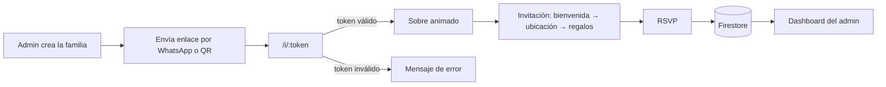

# 💍 Invitación de Boda Digital — Josué & Mariela

Plataforma web para invitar, gestionar y confirmar a los invitados de una boda. Cada familia recibe un **enlace personal** (por WhatsApp o código QR) que abre una invitación animada con su nombre y la cantidad de pases asignados, y desde ahí puede **confirmar su asistencia**. Los novios administran todo desde un **panel privado** con estadísticas en tiempo real y exportación a Excel.

El repositorio también incluye **scripts de diseño** que generan material impreso para la recepción (números de mesa y el vinil del espejo de bienvenida) con la misma identidad visual de la invitación.


---

## Índice

- [Funcionalidades](#-funcionalidades)
- [Flujo del invitado](#-flujo-del-invitado)
- [Stack tecnológico](#-stack-tecnológico)
- [Arquitectura](#-arquitectura)
- [Modelo de datos](#-modelo-de-datos)
- [Rutas](#-rutas)
- [Instalación y uso](#-instalación-y-uso)
- [Scripts de material impreso](#-scripts-de-material-impreso)
- [Calidad de código](#-calidad-de-código)
- [Despliegue](#-despliegue)
- [Documentación adicional](#-documentación-adicional)

---

## ✨ Funcionalidades

### Para los invitados

- **Enlace personalizado** `/i/:token`: valida la invitación contra Firestore y carga los datos de la familia.
- **Sobre animado** con GSAP: el invitado abre el sobre y comienza la experiencia; la música de fondo arranca automáticamente (volumen suave y en bucle, con control para pausarla).
- **Invitación con scroll por secciones** (_snap scroll_):
  1. **Bienvenida** — tarjeta con el nombre de la familia y la guirnalda botánica.
  2. **Ubicación** — datos del lugar, **cuenta regresiva** al evento y botón directo a Google Maps.
  3. **Regalos** — información de la mesa de regalos.
  4. **Confirmación (RSVP)** — el invitado indica si asiste, cuántos pases usará (hasta el máximo asignado), su teléfono y un mensaje para los novios.
- **Confirmación alternativa por WhatsApp** con un mensaje prellenado.
- Diseño **responsive** pensado primero para celular, que es donde se abren los enlaces de WhatsApp.

### Para los novios (panel de administración)

- **Inicio de sesión** con Firebase Authentication (correo y contraseña).
- **Dashboard** con estadísticas: familias invitadas, pases totales, confirmados, declinados y pendientes.
- **Gestión de familias (CRUD)**: crear, editar y eliminar invitaciones, con buscador y estado de cada una (`Pendiente`, `Confirmado`, `Declinado`, `Expirado`).
- **Envío por WhatsApp** en un clic: invitación con el enlace personal o recordatorio del evento.
- **Código QR** por familia, listo para imprimir o compartir.
- **Exportación a Excel** (`.xlsx`) del listado completo con columnas autoajustadas.

---

## 🧭 Flujo del invitado



---

## 🛠 Stack tecnológico

| Área             | Tecnología                                              |
| ---------------- | ------------------------------------------------------- |
| UI               | React 19 + TypeScript                                   |
| Build / dev      | Vite 8                                                  |
| Estilos          | Tailwind CSS 4 con paleta propia (crema, oliva, dorado) |
| Animaciones      | GSAP (timelines)                                        |
| Ruteo            | React Router 7                                          |
| Estado global    | Zustand                                                 |
| Datos remotos    | TanStack Query                                          |
| Formularios      | React Hook Form + Zod                                   |
| Backend          | Firebase: Firestore, Authentication y Hosting           |
| Utilidades       | SheetJS (`xlsx`), `react-qr-code`, `lucide-react`       |
| Material impreso | `@napi-rs/canvas` (PNG/PDF) y `docx` (Word)             |
| Calidad          | ESLint, Prettier, Vitest, Testing Library, Husky        |

---

## 🏗 Arquitectura

```
src/
├── app/            # Punto de entrada, providers y router
├── components/
│   ├── ui/         # Design system: Button, Card, Input, Badge, Modal, Typography
│   ├── countdown/  # Reloj de cuenta regresiva
│   └── invitation/ # Elementos decorativos (guirnalda botánica)
├── config/         # Variables de entorno, Firebase, rutas y constantes
├── layouts/        # PublicLayout (música de fondo) y AdminLayout
├── lib/            # Acceso a Firestore, auth, estadísticas y WhatsApp
├── pages/          # Vistas públicas y del panel (pages/admin)
├── services/       # Lógica de negocio (FamilyService)
├── store/          # Estado global con Zustand (+ tests)
├── styles/         # Estilos globales
└── types/          # Interfaces TypeScript
scripts/            # Generadores de material impreso (Node)
docs/               # Especificaciones y guías de diseño
```

**Decisiones de diseño**

- **Repositorio desacoplado**: `FamilyService` depende de la interfaz `InvitationRepository` y no de Firestore directamente, así el backend se puede cambiar o simular en pruebas.
- **Lógica pura separada de la carga de datos**: el cálculo de estadísticas (`lib/statistics.ts`) es una función pura y testeable.
- **Plantillas de mensaje centralizadas**: los textos de WhatsApp viven en un solo lugar (`lib/whatsapp.ts`); agregar un nuevo tipo de mensaje no obliga a tocar las vistas.
- **Única fuente de verdad para estados**: las opciones de estado de invitación se generan desde `config/constants.ts`.

---

## 🗄 Modelo de datos

Colección de Firestore **`invitaciones`** — un documento por familia:

| Campo               | Tipo     | Descripción                                           |
| ------------------- | -------- | ----------------------------------------------------- |
| `codigo`            | `string` | Código único usado en el enlace personal              |
| `nombreFamilia`     | `string` | Nombre que se muestra en la invitación                |
| `telefono`          | `string` | Número para enviar la invitación por WhatsApp         |
| `cantidadPermitida` | `number` | Pases asignados a la familia                          |
| `confirmados`       | `number` | Pases confirmados por la familia                      |
| `estado`            | `string` | `Pendiente` · `Confirmado` · `Declinado` · `Expirado` |
| `mensaje`           | `string` | Mensaje opcional para los novios                      |
| `fechaCreacion`     | `string` | Fecha ISO de creación                                 |

Las reglas de seguridad están en [`firestore.rules`](firestore.rules): crear y eliminar invitaciones requiere sesión iniciada.

---

## 🧩 Rutas

| Ruta                           | Vista                                  |
| ------------------------------ | -------------------------------------- |
| `/i/:token`                    | Valida el enlace personal del invitado |
| `/envelope`                    | Sobre animado                          |
| `/invitation`                  | Invitación completa con sus secciones  |
| `/location`, `/gifts`, `/rsvp` | Atajos a cada sección de la invitación |
| `/admin/login`                 | Inicio de sesión                       |
| `/admin/dashboard`             | Estadísticas                           |
| `/admin/families`              | Listado, búsqueda, WhatsApp y QR       |
| `/admin/family/new`            | Nueva familia                          |
| `/admin/family/edit/:id`       | Editar familia                         |
| `/admin/export`                | Exportar a Excel                       |

---

## 🚀 Instalación y uso

### Requisitos

- Node.js 20 o superior
- Un proyecto de Firebase con Firestore y Authentication (correo/contraseña) habilitados

### Pasos

```bash
# 1. Clonar el repositorio
git clone https://github.com/bardalesjosue/invitacion_boda.git
cd invitacion_boda

# 2. Instalar dependencias
npm install

# 3. Configurar variables de entorno
cp .env.example .env
# completar .env con las credenciales de tu proyecto de Firebase

# 4. Levantar el servidor de desarrollo
npm run dev
```

### Variables de entorno

```env
VITE_FIREBASE_API_KEY=
VITE_FIREBASE_AUTH_DOMAIN=
VITE_FIREBASE_PROJECT_ID=
VITE_FIREBASE_STORAGE_BUCKET=
VITE_FIREBASE_MESSAGING_SENDER_ID=
VITE_FIREBASE_APP_ID=
```

### Comandos disponibles

| Comando              | Descripción                                 |
| -------------------- | ------------------------------------------- |
| `npm run dev`        | Servidor de desarrollo con recarga en vivo  |
| `npm run build`      | Verificación de tipos y build de producción |
| `npm run preview`    | Sirve localmente el build de producción     |
| `npm run lint`       | Análisis estático con ESLint                |
| `npm run format`     | Formatea el código con Prettier             |
| `npm run type-check` | Verifica tipos sin generar archivos         |
| `npm test`           | Ejecuta las pruebas con Vitest              |

---

## 🖨 Scripts de material impreso

Además de la web, el proyecto genera piezas para el día del evento reutilizando la tipografía (_Brittany Signature_, _Playfair Display_, _Montserrat_), el fondo floral y la paleta de la invitación. Se ejecutan con Node desde la raíz:

| Script                                          | Resultado                                                                                                        |
| ----------------------------------------------- | ---------------------------------------------------------------------------------------------------------------- |
| `node scripts/generate-table-numbers.mjs`       | Tarjetas de **número de mesa** (1 a 10) en PNG, en `numeros-mesa/`                                               |
| `node scripts/generate-table-numbers-sheet.mjs` | Hojas **carta horizontal en PDF** con dos mesas por página y guías de recorte                                    |
| `node scripts/generate-table-numbers-docx.mjs`  | La misma composición en **Word (.docx)** para editar o imprimir                                                  |
| `node scripts/generate-mirror-sign.mjs`         | Diseño de **vinil para el espejo de bienvenida** (80 × 170 cm): archivo de corte transparente y una vista previa |

> Los scripts de hojas PDF y Word usan los PNG de las tarjetas, así que primero hay que correr `generate-table-numbers.mjs`. Las carpetas de salida están en `.gitignore` porque son archivos generados.

---

## ✅ Calidad de código

- **TypeScript estricto** en toda la aplicación.
- **ESLint + Prettier** con reglas para React Hooks.
- **Husky + lint-staged**: antes de cada commit se ejecutan el linter y el formateo sobre los archivos modificados.
- **Vitest + Testing Library** para pruebas unitarias (por ejemplo, el store global).

---

## ☁️ Despliegue

La aplicación se publica en **Firebase Hosting** como SPA (todas las rutas se reescriben a `index.html`):

```bash
npm run build
firebase deploy
```

Esto publica el contenido de `dist/` junto con las reglas e índices de Firestore definidos en `firebase.json`.

---

## 📚 Documentación adicional

En la carpeta [`docs/`](docs/) hay especificaciones de apoyo: arquitectura, base de datos, componentes, animaciones, guía de UI, reglas de Firebase y roadmap.

---

Hecho con cariño para el **4 de diciembre** 🤍 — Josué Bardales
