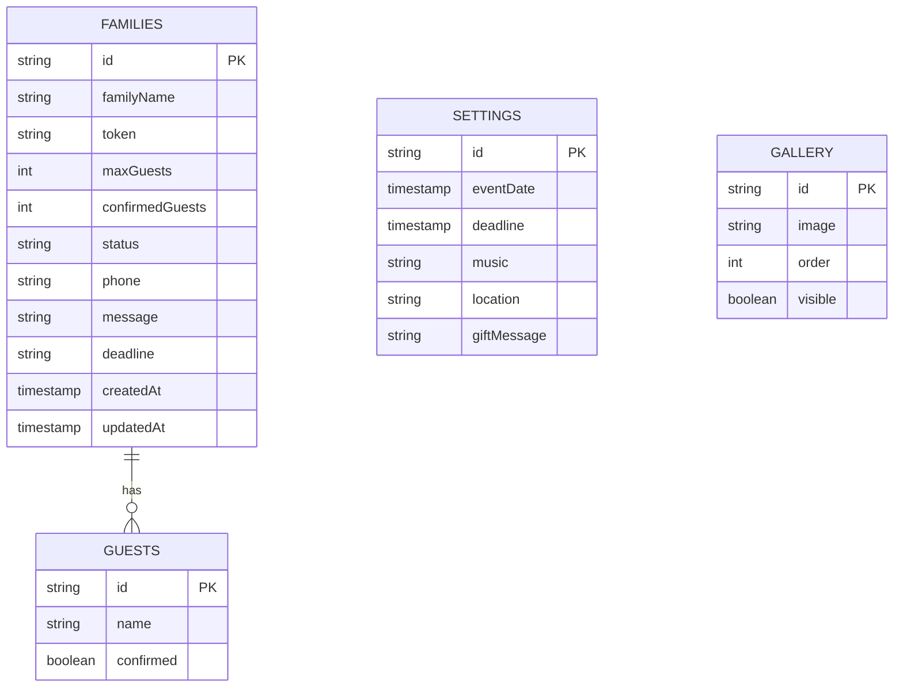

# Database Schema Specifications - Wedding Invitation Platform

This document describes the Firestore database collections, documents, subcollections, and data mappings.

## Firestore Schema Structure

### 1. `families` Collection

Each document represents a household invitation.

- **Path**: `/families/{familyId}`
- **Fields**:
  - `id`: string (doc ID)
  - `familyName`: string (e.g., "Familia Bardales")
  - `token`: string (unique alphanumeric token for secure guest access)
  - `maxGuests`: number (total pases allowed)
  - `confirmedGuests`: number (number of verified attendees)
  - `status`: 'pending' | 'confirmed' | 'declined' | 'expired'
  - `phone`: string (contact number)
  - `message`: string (message left by family during RSVP)
  - `deadline`: string (ISO date limit to confirm RSVP)
  - `createdAt`: string (ISO timestamp)
  - `updatedAt`: string (ISO timestamp)

### 2. `guests` Subcollection

Nested inside each family document to specify attendance per individual.

- **Path**: `/families/{familyId}/guests/{guestId}`
- **Fields**:
  - `id`: string (doc ID)
  - `name`: string (e.g., "Josué Bardales")
  - `confirmed`: boolean (whether they will attend)

### 3. `settings` Collection

Global configuration variables.

- **Path**: `/settings/global`
- **Fields**:
  - `eventDate`: string (ISO datetime for wedding countdown)
  - `deadline`: string (ISO global limit)
  - `music`: string (URL to backing mp3 song file)
  - `location`: string (address and map coordinates)
  - `giftMessage`: string (bank info / department store registry numbers)

### 4. `gallery` Collection

Metadata of loaded pictures.

- **Path**: `/gallery/{imageId}`
- **Fields**:
  - `id`: string (doc ID)
  - `image`: string (storage download URL)
  - `order`: number (indexing position)
  - `visible`: boolean (viewable status)
